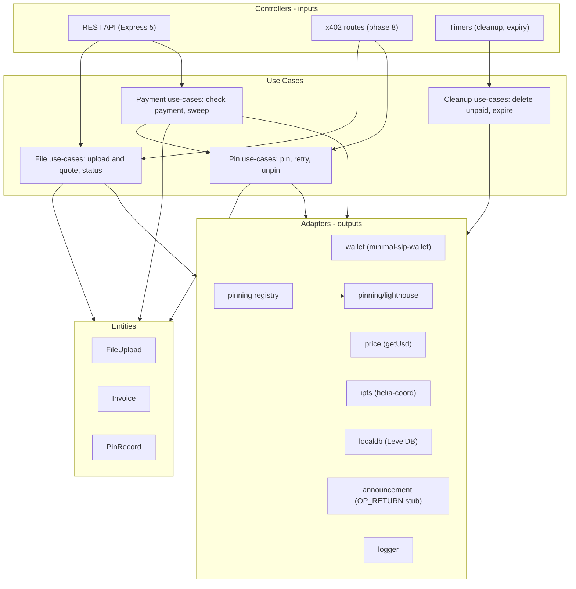
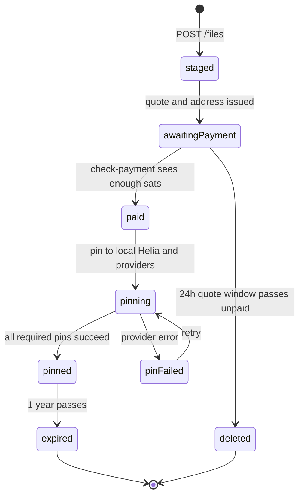

# bch-file-hosting — Long-Term Project Plan

**Status**: DRAFT
**Created**: 2026-10-08
**Companion doc**: [short-term-plan.md](./short-term-plan.md)

---

## 1. Vision

`bch-file-hosting` is a pay-per-file IPFS hosting service paid in Bitcoin Cash
(BCH). A user (human or AI agent) uploads a file over a REST API, receives a
price quote in BCH and a unique payment address, pays, and receives an IPFS CID
plus download links. Paid files are pinned to the service's own Helia IPFS node
and to at least one third-party pinning service, so the content survives even
if our node goes offline.

### Goals

- Simple, agent-friendly REST workflow: upload -> pay -> confirm.
- Transparent, predictable pricing: **$0.01 USD per MB per year**, billed in BCH.
- Redundant hosting: local Helia node + pluggable third-party pinning providers.
- Provider-agnostic: swapping Lighthouse for Pinata (or adding a second
  provider) is a config change plus one adapter file.
- Machine-payable: an x402-bch flavor of the API so AI agents can pay inline.
- First-class clients: CLI, React web UI, and integration into the psf-memo
  ecosystem (`psf-memo-client`, `psf-memo-cli`).
- Built with Clean Architecture and high unit-test coverage, so the Swarm Forge
  4-agent swarm can extend it safely.

### Non-goals (for now)

- User accounts, logins, or per-user dashboards.
- PSF token burns or PSFFPP Pin Claims (a stubbed OP_RETURN path is reserved for
  a future on-chain announcement; see section 9).
- Encrypted/private files, access control, or token gating.
- Multi-year terms or renewals (v1 sells exactly one year; see open questions).
- Content moderation tooling beyond an admin unpin/delete endpoint.

---

## 2. Decisions Log

Decisions agreed during planning (2026-10-08). Change them here first, then in
code.

| # | Topic | Decision |
|---|-------|----------|
| D1 | Hosting term | Fixed **1 year** per payment. Expiry policy is an open question (section 14). |
| D2 | Base price | `USD_PER_MB_YEAR` env var, default `0.01`. No separate markup. |
| D3 | Units | Decimal: 1 MB = 1,000,000 bytes; 100 KB = 100,000 bytes. |
| D4 | Minimum size | Files smaller than 100,000 bytes are billed as 100,000 bytes. |
| D5 | Minimum invoice | Configurable `MIN_INVOICE_SATS` floor (default 2000) so invoices stay above the 546-sat dust limit and cover sweep fees. |
| D6 | Price oracle | `minimal-slp-wallet` `getUsd()` (USD per BCH). |
| D7 | BCH backend | Configurable like ipfs-file-stager: `web2` (`rest-api`, bch.fullstack.cash/v6), `web3` (`consumer-api`, free-bch.fullstack.cash), or the x402 REST server. |
| D8 | Payment acceptance | 0-conf (mempool) accepted. Small underpayment tolerance (`UNDERPAY_TOLERANCE_SATS`). Quote locked for 24 hours. |
| D9 | Funds handling | Paid invoice addresses are swept to a treasury address. |
| D10 | Key storage | Only `hdIndex` is stored; invoice keys are re-derived from the server mnemonic. No WIFs in the database. |
| D11 | Payment checking | User-triggered (`POST /files/check-payment`). No background polling in v1. |
| D12 | PSFFPP | Independent of PSFFPP. A stubbed `announcement` adapter reserves a code path for a future OP_RETURN broadcast. |
| D13 | Database | LevelDB (`level` npm package), matching psf-memo-db and x402-bch-facilitator. |
| D14 | Max upload | Configurable `MAX_FILE_SIZE_BYTES`, default 100,000,000 (100 MB). |
| D15 | IPFS node | `helia-coord` (joins the PSF network, circuit relays), like ipfs-file-stager. |
| D16 | Download links | Both: our own `GET /download/:cid` endpoint plus a list of public gateway URLs (provider gateways included). |
| D17 | Third-party fan-out | One active provider in v1, but the data model stores a list of pins per file so several providers can be used later. |
| D18 | First provider | Lighthouse, on a subscription plan; cost covered by the per-MB price. |
| D19 | Auth | Public endpoints with rate limiting, plus an admin API key (`ADMIN_API_KEY`) for ops endpoints. No user accounts. |
| D20 | x402 pricing | Custom middleware that computes the price from the upload size (stock `x402-bch-express` only supports static per-route prices). |
| D21 | Runtime | Node 22 LTS, Express 5, ESM (`"type": "module"`), Standard.js lint. |
| D22 | Tests | Mocha + Chai + Sinon + c8. Unit tests fully mocked. Manual mainnet integration tests with small amounts. Gherkin acceptance specs (APS) once Swarm Forge is integrated. |
| D23 | Repo layout | Monorepo like psf-memo, with Swarm Forge at the root. |
| D24 | Swarm Forge source | Vendor psf-memo's adapted copy (verify.sh, monorepo.prompt, process improvements), same agent backend (pi + `deepseek-v4.1-flash:cloud`). |
| D25 | Who builds the core port | A single agent session builds the core port (phase 3). The swarm takes over from phase 5 onward. |

---

## 3. Reference Sources

| Source | Path | Used for |
|--------|------|----------|
| ipfs-file-stager (deprecated template) | `/home/trout/work/psf/code/ipfs/ipfs-file-stager` | Upload flow, Helia setup, HD invoice addresses, sweep, 24h cleanup |
| PSF LLM wiki | `/home/trout/work/llm/psf-llm-wiki` | Cash Stack, minimal-slp-wallet, helia-coord, x402-bch background |
| Clean Architecture prompt | `/home/trout/work/llm/prompt/clean-architecture/prompt.md` | API layering and dependency injection |
| Testing prompt | `/home/trout/work/llm/prompt/testing/testing-prompt.md` | Mocha/Chai/Sinon patterns |
| React prompt | `/home/trout/work/llm/prompt/react/prompt.md` | Web UI (Vite + React + react-bootstrap) |
| CLI prompt | `/home/trout/work/llm/prompt/cli/README.md` | CLI (Commander, one class per command) |
| x402 (Coinbase) | `/home/trout/work/x402/server/x402-base/x402` | Protocol background |
| x402-bch | `/home/trout/work/x402/server/x402-bch` | BCH payment middleware, facilitator, axios client |
| Swarm Forge | `/home/trout/work/llm/swarm-forge` | Upstream 4-agent framework |
| psf-memo | `/home/trout/work/psf/code/psf-memo` | Template for vendoring Swarm Forge into a JS monorepo |
| Pinning candidates | [ipfs-third-party-candidates.md](./ipfs-third-party-candidates.md) | Provider study input |
| Lighthouse docs | https://docs.lighthouse.storage/intro | First provider adapter |

### Lessons from ipfs-file-stager (fix, do not port)

1. **Units bug**: it compares `getBalance()` (satoshis) to `bchCost` (BCH), so
   almost any balance counts as paid. The new code stores and compares
   **satoshis only**.
2. **In-memory cleanup list**: staged CIDs live in RAM, so a restart orphans
   unpaid files. The new code stores file state in LevelDB.
3. **WIFs in MongoDB**: replaced by re-deriving keys from `hdIndex`.
4. **Temp files never deleted** after upload: the new upload path always
   removes the temp file.
5. **Ungated payment endpoints** and leftover auth/users/JSON-RPC boilerplate:
   dropped; only the endpoints in this plan exist.
6. **Timers not cleared on shutdown**: every interval handle is tracked and
   cleared.
7. **Hardcoded mnemonic and secrets** in production scripts: all secrets come
   from env vars; `.env.example` documents them.
8. **No download link**: the new API returns our endpoint plus gateway URLs.

---

## 4. Monorepo Layout

```text
bch-file-hosting/
├── bch-file-hosting-api/      # Express 5 REST API (phases 3, 5, 8)
├── bch-file-hosting-cli/      # Commander CLI (phase 6)
├── bch-file-hosting-web/      # Vite + React + react-bootstrap UI (phase 7)
├── dev-docs/                  # Planning docs (this file)
├── specs/                     # Cross-component backlog (Swarm Forge)
├── specifier-prompt.md        # Standing specifier briefing (Swarm Forge)
├── swarmforge/                # Vendored Swarm Forge (conf, roles, constitution, scripts)
├── doc/                       # Swarm Forge reference docs
├── docs/                      # Process notes + architect reviews
├── tools/                     # sf-queue, sf-tokens
├── production/                # Docker Compose (later phase)
├── swarm, close-swarm, bb.edn # Swarm Forge launchers
└── README.md
```

Each component has its own `package.json`, `specs/*.feature`, `test/`, and
`npm test` / `npm run lint` scripts so `swarmforge/scripts/verify.sh` can verify
them independently.

---

## 5. API Architecture (Clean Architecture)

The API follows `/home/trout/work/llm/prompt/clean-architecture/`:
controllers are inputs, adapters are outputs, use-cases hold business logic,
entities hold domain validation. Dependencies are injected inward and placed on
`this` so unit tests can stub them.



### Startup order

`bin/server.js` -> `Controllers` builds `Adapters` (open LevelDB, open wallet,
start Helia, init pinning registry) -> builds `UseCases({ adapters })` -> attaches
REST routes and timers. Shutdown reverses this and clears all timer handles.

---

## 6. File Lifecycle



In v1 `staged` and `awaitingPayment` happen in the same request: the upload is
added to Helia (not pinned), the quote is computed, and the invoice is saved.
`pinning` is synchronous inside `check-payment` in v1; it can become a queued job
later if provider uploads are slow. What happens at `expired` is an open
question (section 14).

---

## 7. Pricing

### Formula

```text
billedBytes = max(fileSizeBytes, MIN_BILLED_BYTES)          # MIN_BILLED_BYTES = 100000
usdPrice    = billedBytes / 1_000_000 * USD_PER_MB_YEAR     # USD_PER_MB_YEAR = 0.01
usdPerBch   = wallet.getUsd()
priceSats   = max(ceil(usdPrice / usdPerBch * 1e8), MIN_INVOICE_SATS)
```

The response also reports `priceBch = priceSats / 1e8` for display, but all
storage and comparisons use integer satoshis.

### Worked examples (assuming BCH = $400)

| File size | Billed bytes | USD | Raw sats | Invoice sats |
|-----------|--------------|-----|----------|--------------|
| 20 KB | 100,000 | $0.001 | 250 | 2,000 (floor) |
| 1 MB | 1,000,000 | $0.01 | 2,500 | 2,500 |
| 25 MB | 25,000,000 | $0.25 | 62,500 | 62,500 |
| 100 MB | 100,000,000 | $1.00 | 250,000 | 250,000 |

With the default 2,000-sat floor, every file up to about 0.8 MB pays the floor
when BCH is $400. Tune `MIN_INVOICE_SATS` as the BCH price moves.

### Quote lock and tolerance

- The quote (`priceSats`) is fixed when the invoice is created and is valid for
  `QUOTE_TTL_HOURS` (default 24), the same window as unpaid-file deletion.
- A payment is accepted when `receivedSats >= priceSats - UNDERPAY_TOLERANCE_SATS`
  (default tolerance 100 sats, to absorb wallet rounding).
- Overpayments are accepted and swept; there are no refunds in v1.

---

## 8. Payment Design

### Invoice addresses

- The server wallet is a `minimal-slp-wallet` instance loaded from `MNEMONIC`
  (or a `WALLET_FILE`).
- Each invoice gets a fresh address from
  `wallet.getKeyPair(hdIndex)` (derivation path `m/44'/245'/0'/0/<hdIndex>`,
  the minimal-slp-wallet default). Index 0 is the server's main wallet; invoice
  indexes start at 1.
- The next index is a LevelDB counter (`meta:nextHdIndex`), incremented under an
  in-process mutex so two concurrent uploads never share an address.
- Addresses are never reused.

### Checking payment

- `POST /files/check-payment { paymentAddress }` looks up the invoice and calls
  `wallet.getBalance({ bchAddress })`, which returns confirmed + unconfirmed
  **satoshis** (so 0-conf counts).
- If paid: mark the invoice `paid`, sweep, pin, return the CID and links.
- If not paid: return `receivedSats` and `requiredSats` with status `unpaid`.
- Calls are idempotent: checking an already-paid invoice returns the stored
  result without re-sweeping or re-pinning.

### Sweeping

- Re-derive the invoice key from `hdIndex`, build a temporary wallet from the
  WIF, and call `sendAll(TREASURY_ADDRESS)`.
- Sweep failures do not block pinning: the invoice is marked `sweepPending` and a
  timer retries later. An admin endpoint lists unswept invoices.

### Restart safety

All invoice and file state lives in LevelDB, so a restart keeps the cleanup
schedule, the HD counter, and pending sweeps.

### Late payments

Payments that arrive after an unpaid file has been deleted are swept by an admin
action; there is no automated refund in v1 (open question).

---

## 9. Announcement Adapter (OP_RETURN stub)

A future version will broadcast an OP_RETURN transaction for each paid file (for
example, to publish the CID on-chain). v1 ships the interface and a no-op
implementation:

```js
// src/adapters/announcement/noop-announcer.js
class NoopAnnouncer {
  async announce ({ cid, filename, sizeBytes, paymentTxid }) {
    return { announced: false, txid: null }
  }
}
```

A later `OpReturnAnnouncer` will use `wallet.sendOpReturn()`. The payload format
(Lokad ID, fields) is an open question.

---

## 10. Pinning Providers

### Adapter contract

Every provider (including the local Helia node) implements the same interface,
so use-cases never import a provider directly:

```js
class PinningProvider {
  get name () {}                 // 'lighthouse', 'pinata', 'local-helia', ...
  get capabilities () {}         // { pinByCid: bool, uploadBytes: bool, unpin: bool }
  async pin ({ cid, filePath, filename, sizeBytes }) {}  // -> { providerCid, providerRef }
  async status (cid) {}          // -> 'pinned' | 'pinning' | 'failed' | 'unknown'
  async unpin (cid) {}
  gatewayUrl (cid) {}            // -> public URL or null
}
```

- `pinByCid` providers fetch content from the IPFS network (our Helia node must
  be reachable). `uploadBytes` providers receive the file bytes directly; the
  adapter must check that the returned CID matches ours (same CID version and
  chunking).
- A config-driven registry (`PINNING_PROVIDERS=lighthouse`) builds the active
  provider list at startup. v1 uses one provider; the use-case already loops
  over the list.
- Each file stores `pins[]`: `{ provider, status, providerRef, pinnedAt, error }`.

### Provider study (phase 5 deliverable)

Before writing each adapter, record in `dev-docs/pinning-providers.md`:

| Criterion | Why it matters |
|-----------|----------------|
| API style and official SDK (Node ESM?) | Adapter effort |
| Auth model (API key, JWT, wallet signature) | Config and secret handling |
| Pin by CID vs upload bytes | Whether our node must be reachable; CID matching |
| Unpin / delete support | Needed for expiry and moderation |
| Pricing model (subscription, per-GB, pay-once) | Must fit $0.01/MB/yr |
| Filecoin or other durable backing | Long-term durability |
| Gateway and retrieval limits | Download links |
| Rate limits and max file size | Must accept `MAX_FILE_SIZE_BYTES` |
| Status / proof API | Pin verification |

Note: [ipfs-third-party-candidates.md](./ipfs-third-party-candidates.md)
describes Lighthouse as "pay-once perpetual", but the current Lighthouse docs
describe monthly or annual plans. v1 assumes a subscription plan.

### Shortlist

1. **Lighthouse** — first adapter (API key provided by the project owner).
2. **Pinata** — classic pinning API, pin-by-CID support; most likely second adapter.
3. **Filebase** — S3-compatible IPFS; very low per-GB cost.
4. **Storacha** — successor to Web3.Storage.
5. **Filecoin Onchain Cloud** — Synapse SDK; Filecoin-native.

---

## 11. x402-bch Endpoints (phase 8)

x402-bch uses HTTP 402 plus the `utxo` scheme: the client pre-funds a UTXO to the
server, then signs per-request debits in a `PAYMENT-SIGNATURE` header; a
facilitator (`x402-bch-facilitator`) verifies them against a LevelDB ledger.

Stock `x402-bch-express` only supports static prices per route, so this phase
adds custom middleware:

1. `POST /x402/files` arrives with the file (or `Content-Length` /
   `X-File-Size` for a pre-flight).
2. Middleware computes `priceSats` with the same pricing use-case as section 7.
3. Without a valid `PAYMENT-SIGNATURE`, respond 402 with `PaymentRequired`
   (`scheme: 'utxo'`, `amount: priceSats`, `payTo: TREASURY_ADDRESS`).
4. With a signature, call the facilitator `/verify`; on success, run upload +
   pin in one request and return the CID and links.

Requirements: run a facilitator instance (`FACILITATOR_URL`), reuse helpers from
`x402-bch-express` where possible, and test clients with `x402-bch-axios`.
Rejecting oversized uploads early (before buffering the body) is part of this
phase.

---

## 12. Clients

### CLI (phase 6) — `bch-file-hosting-cli/`

Follows `/home/trout/work/llm/prompt/cli/README.md`: ESM, Commander,
`program.parseAsync`, one class per command in `src/commands/` with
`validateFlags()` and `run()`, Standard.js, Mocha/Chai/Sinon, `*.unit.js` tests.

Planned commands:

| Command | Purpose |
|---------|---------|
| `file-upload -f <path>` | Upload and print quote + payment address |
| `file-pay -a <address>` | Pay the invoice from the CLI wallet |
| `file-check -a <address>` | Check payment, print CID + links |
| `file-status -c <cid>` | Show file and pin status |
| `file-host -f <path>` | Upload, pay, and check in one step (end-to-end smoke test) |
| `wallet-create`, `wallet-balance` | Minimal wallet for paying |

### Web UI (phase 7) — `bch-file-hosting-web/`

Follows `/home/trout/work/llm/prompt/react/prompt.md`: Vite + React +
react-bootstrap + react-router. Keep protocol logic in `src/services/` (pure,
unit-testable) and UI in `src/components/`, matching psf-memo-client so phase 9
is a port rather than a rewrite.

Screens: upload (drag and drop), quote with QR code for the payment address and
a countdown to quote expiry, payment-status polling, and a result page with CID,
download link, and gateway links.

### psf-memo integration (phase 9)

- **psf-memo-client**: add the upload/pay/result flow as `components/` +
  `services/`, reusing the client's existing wallet to pay the invoice directly.
- **psf-memo-cli**: add `file-*` commands to `psf-memo-cli.js` following
  `src/commands/README.md` (`run()`, `validateFlags()`, shared `reporter.js`,
  `--json` output).
- Coordinate through the psf-memo Swarm Forge backlog
  (`/home/trout/work/psf/code/psf-memo/specs/feature-backlog.md`).

---

## 13. Roadmap

| Phase | Name | Built by | Deliverables | Exit criteria |
|-------|------|----------|--------------|---------------|
| 1 | Long-term plan | Agent + owner | This document | Owner approval |
| 2 | Short-term plan | Agent + owner | [short-term-plan.md](./short-term-plan.md) | Owner approval |
| 3 | Core port | Single agent session | `bch-file-hosting-api/`: upload, Helia staging, BCH invoices, check-payment, local pin, download, 24h cleanup, admin endpoints | Mainnet upload -> pay -> check -> download works; unpaid files removed after 24h; lint + unit tests pass |
| 4 | Swarm Forge integration | Single agent session | Vendored `swarmforge/`, prompts, `specifier-prompt.md`, backlog, first `.feature` | One full specifier -> coder -> refactorer -> architect cycle merged to master |
| 5 | Third-party pinning | Swarm | Provider study doc, `PinningProvider` contract, registry, Lighthouse adapter, `pins[]` tracking, retry timer | Paid file appears in Lighthouse; swapping provider is a config change |
| 6 | CLI | Swarm | `bch-file-hosting-cli/` with commands above | `file-host` completes end to end on mainnet |
| 7 | Web UI | Swarm | `bch-file-hosting-web/` | Upload, pay by QR, and get links in the browser |
| 8 | x402-bch | Swarm | Dynamic-price x402 middleware, `/x402/files`, facilitator deployment notes | `x402-bch-axios` client uploads and pays in one call |
| 9 | psf-memo integration | Swarm (psf-memo swarm) | UI in psf-memo-client, commands in psf-memo-cli | Features merged in psf-memo |

Cross-cutting work to schedule between phases: Docker Compose production setup,
API docs, monitoring of Helia disk usage, and a treasury report endpoint.

---

## 14. Risks and Open Questions

| # | Item | Notes |
|---|------|-------|
| Q1 | Expiry policy | What happens after 1 year: unpin from both, grace period, or renewal endpoint? Needed before the first files expire (2027). |
| Q2 | Renewals / multi-year | v1 is fixed 1 year. Decide whether to add `years` or a renew endpoint. |
| Q3 | OP_RETURN format | Lokad ID and fields for the future announcement adapter. |
| Q4 | Multi-provider fan-out | When to pin to 2+ providers, and whether all must succeed. |
| Q5 | Lighthouse cost model | Subscription cost vs revenue at $0.01/MB/yr; plan limits (Lite 500 GB, Pro 2.5 TB). |
| Q6 | Abuse and moderation | Illegal content takedown path; admin unpin across all providers; terms of service. |
| Q7 | Rate limits | Per-IP limits on uploads and check-payment; unpaid upload spam fills disk for up to 24h. |
| Q8 | Disk and node costs | Helia blockstore growth; staging disk quota; whether to cap total unpaid bytes. |
| Q9 | Late payments / refunds | Payment after deletion or quote expiry; manual vs automated refunds. |
| Q10 | Price volatility | 24h quote lock exposes us to BCH price moves; acceptable at these amounts. |
| Q11 | CID consistency | Upload-bytes providers may produce different CIDs (chunker, CID version, directory wrap). The adapter must detect mismatches. |
| Q12 | Directory wrapping | ipfs-file-stager used `wrapWithDirectory: true` (keeps filename). Decide whether the returned CID is the directory or the raw file. |
| Q13 | Helia reachability | Pin-by-CID providers need our node reachable; may require a public IP or circuit relay config. |
